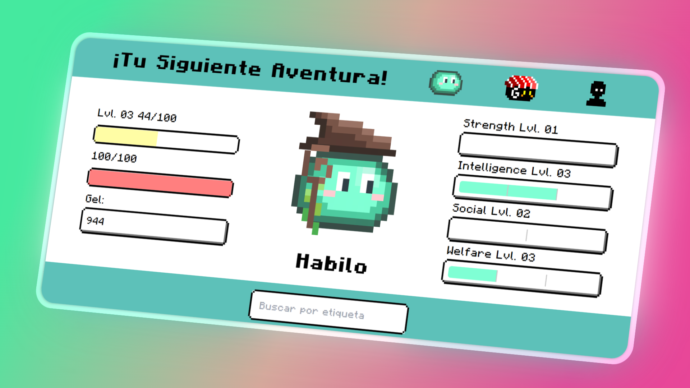

<h1 align="center" id="title">Hábilo - Your Fellow Adventurer ⚔️</h1>

  
  
   
  
  
  

Hábilo is a PWA that combines task management and habit tracking with RPG elements. Create tasks/habits ("missions") and assign stats like Strength or Intelligence. Complete them to earn rewards, level up your adventurer companion, and collect gel (in-game currency) to customize their appearance in the store.

<h2 align="center">Table of Contents</h2>

- [Preview](#preview)
- [Features](#features)
- [Installation](#installation)
- [Built With](#built-with)
- [Author](#author)

## Preview

## Features

- 🎯 **Task Management**: Create tasks/habits with priority, stats, due dates, and tags
- 📊 **Progress Tracking**: Visualize streaks via heatmap calendar
- 🏆 **Rewards System**: Earn gel and level up stats by completing missions
- 🎨 **Customization**: Personalize your companion with store items and nicknames
- 🔄 **Cross-Device Sync**: Export/import progress between devices
- 📴 **Offline-First**: Works without internet; data stored locally (no account required)

## Installation

1. Clone the repository
2. Open in your preferred code editor
3. Install dependencies: `npm install`
4. Start development server: `npm run dev`

## Built With

- ⚡ [Vite](https://vitejs.dev/) - Next-gen frontend tooling
- ⚛️ [React](https://react.dev/) - JavaScript library
- 📦 Local-first architecture

## Author

**Franco Rodriguez**  
👔 [LinkedIn](https://www.linkedin.com/in/jeannrodriguez)
